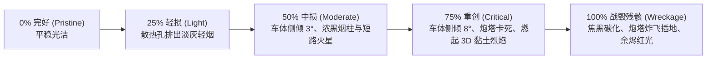

# 特化敌军机甲与防御炮台工程抢修与受损系统规范 (Enemy & Turret Mechanics Design)

> **适用项目**：Tank Battle (Godot 4.5+ / WebGL 3D Studio)  
> **核心机制**：特化机甲战术 AI、工程车主动电焊抢修、防御炮台 1x1 网格部署、5 阶段渐进受损与残骸废墟

---

## 1. 敌军工程抢修车 (Engineer) 战场救援机制

### 1.1 伤员智能巡检与路径机动 (AI Triage & Follow)
- **扫描范围**：以自身为中心半径 `4.5` 网格范围；
- **巡检逻辑**：优先搜寻生命值比例最低（`hp / maxHp` 最小）且未彻底战毁的友军单位（包含战车与防御炮台）；
- **机动跟随**：与目标保持 `1.2 ~ 1.8` 距离，自动规避障碍物并跟随受创友军机动。

### 1.2 三节铰接工程吊臂与电焊特效 (Articulated Arm & Welding Arc)
- **动作执行**：工程车停靠后，旋转底座转向受损友军，3 节机械臂下压展开；
- **高能电弧粒子**：焊枪喷嘴喷射高亮青蓝等离子电弧（`0x00d2d3` / `0x55efc4`，发光强度 `5.5`）与随机抛射的电焊火花（Welding Sparks）；
- **动态光斑**：在目标表面生成周期性明暗跳动的冷色点光源。

### 1.3 生命恢复与受损状态逆转 (Continuous Healing & Restoration)
- **治疗速率**：每 `450ms` 为受损单位恢复 `+12 HP`，并弹出绿色战斗治愈跳字（Floating Text: `+12 抢修`）；
- **受损逆转**：随着血量回升，受伤战车上的**烈焰熄灭、浓黑烟消散、车身倾斜回正**；
- **满血复原**：当血量恢复至 100% 满血时，触发翠绿能量扩散环与欢庆蓄力弹跳（Celebration Hop）。

---

## 2. 敌军防御机枪炮台 (Defense Turret) 架构

### 2.1 标准 1x1 网格包围盒对齐 (Footprint Alignment)
- **水泥防爆基座**：底面精准贴合 `Y = 0.0` 地表，几何尺寸严格限定为 `0.92 × 0.26 × 0.92`，四周预留 `0.04` 缓冲间隙，彻底杜绝与相邻瓦片穿模；
- **四角防爆钢板与铆钉**：四角镶嵌外凸铸铁板与金黄凸面地脚螺栓（Steel Studs）；
- **回转座圈**：位于 `Y = 0.30`，360° 同心旋转，无偏心晃动。

### 2.2 自动索敌与双联重炮火控 (Auto-Tracking & Fire Control)
- **索敌半径**：`7.5` 格，360° 全向水平追踪；
- **双联重炮**：双联装带积碳导热套的速射机炮，炮口装配多孔矩阵式消焰制退器；
- **智能光电头**：顶部雷达天线常态自旋扫描，红色热成像瞄准具（Optical Pod）锁定目标后高亮闪烁并按 `2.4s` 周期发射双发穿甲重弹。

### 2.3 战损破坏与残骸废墟形态 (Broken Wreckage)
- **混凝土炸毁崩解**：基座开裂坍塌，炮塔壳体炸飞倾斜 35° 侧倒在水泥废墟旁；
- **炮管弯折炸膛**：双管机炮扭曲焦黑，座圈中心暴露红热余烬（Embers）与黑烟；
- **工程师救援**：敌方工程车可对受创炮台进行维修；彻底战毁后保留断壁残垣作为不可通行的掩体。

---

## 3. 5 阶段渐进式受损状态机 (Progressive Damage States)

所有战车与防御设施均接入统一受损状态机：

- **战地纳米修复**：调用 `playRepairEffect` 时，自下而上激发翠绿能量光环，10 颗青绿光斑向中心汇聚，形变复原并弹出 `+100 满血修复!` 跳字。
