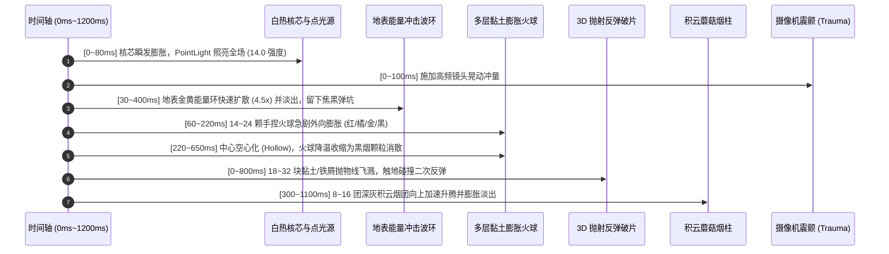

# 3D 黏土大爆炸物理与程序化音效架构规范 (VFX & Explosion Architecture)

> **适用项目**：Tank Battle (Godot 4.5+ / WebGL 3D Studio)  
> **核心机制**：6 阶段多层动力学黏土大爆炸、地表二次反弹破片物理、Web Audio 超重低音合成

---

## 1. 6 阶段多层动力学黏土大爆炸架构 (Multi-Layer Clay Explosion)



### 1.1 核心层级物理参数

1. **瞬发白热核芯与全局动态打光 (Nuclear Flash & PointLight)**：
   - 动态点光源颜色 `0xffaa33`，初始强度 `14.0 * scale`，照射范围 `15.0 * scale`；
   - 180ms 内按指数衰减为 0，瞬发点亮周围地形瓦片与战车机甲。
2. **地表能量冲击波圆环 (Ground Shockwave)**：
   - 贴地圆环（`Y = 0.05`，材质 `0xfdcb6e`，自发光强度 `4.0`）；
   - 在 400ms 内半径迅速由 `0.4` 扩大至 `3.2`，并在地面留下一道焦黑碳化弹坑印记（保留 3.5 秒）。
3. **空心化冲散手捏黏土火球 (Expanding Hollow Clay Fireballs)**：
   - 包含鲜红、橘黄、暖金与焦炭深灰 4 色渐变层；
   - 前期向外放射形变膨胀，中期核心区域空心化（Hollow Ring Dissipation），杜绝死板实心大球。
4. **3D 弹道重力与地表反弹破片 (Bouncing Shrapnel Physics)**：
   - 随机抛射 18~32 块不规则手捏破片，水平初速度 `2.5 ~ 7.5`，垂直初速度 `4.5 ~ 10.0`；
   - 重力加速度 `g = 14.0`，在 `Y <= 0.04` 处触发地表碰撞判定；
   - 垂直速度按 `0.38` 阻尼弹性反弹，水平速度按 `0.65` 衰减，支持 2~3 次真实二次弹跳。
5. **升腾积云蘑菇烟柱 (Rising Billowing Smoke)**：
   - 8~16 团深灰烟团以 `1.2 ~ 2.8` 垂直速度上升，膨胀率 `2.2`，随高度上升逐渐透明消散。

---

## 2. Web Audio 程序化音频合成规范 (Audio Synthesis Engine)

杜绝外部静态 wav 文件依赖，所有音频在运行时通过原生 Web Audio API 动态振荡器与滤波器程序化生成：

```javascript
// 1. 低频次声波超重低音 (Sub-Bass Boom)
const subOsc = ctx.createOscillator();
subOsc.type = 'sine';
subOsc.frequency.setValueAtTime(160, t);
subOsc.frequency.exponentialRampToValueAtTime(20, t + 0.48); // 160Hz 快速滑落至 20Hz

// 2. 带通共振塑形黏土碎裂噪音 (Crunchy Clay Fracture Burst)
const filter = ctx.createBiquadFilter();
filter.type = 'bandpass';
filter.frequency.setValueAtTime(850, t);
filter.frequency.exponentialRampToValueAtTime(80, t + 0.42); // 850Hz 骤降至 80Hz
filter.Q.setValueAtTime(2.8, t); // 高 Q 值共鸣金属与砖石质感
```
